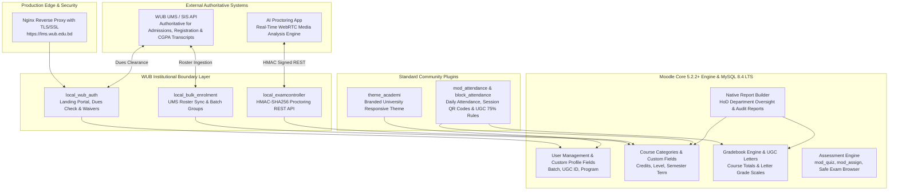

# WUB Moodle Production Deployment Readiness Audit

**Target Institution:** World University of Bangladesh (WUB)  
**System Under Audit:** Production Moodle LMS Environment  
**Audit Baseline Date:** September 18, 2026  
**Auditor Roles:** Senior Moodle LMS Architect, Senior Moodle Plugin Developer, University ERP/LMS Integration Architect, Moodle Security Engineer, Production Deployment Reviewer  

---

## 1. Executive Summary

This audit evaluates whether the World University of Bangladesh (WUB) Moodle installation (`5.2.2+`, Build `20260911`) is ready for live university-wide academic operations. Operating inside Docker containers backed by **Oracle MySQL 8.4.11 LTS**, **PHP 8.4.25-FPM**, and **Nginx 1.28.3**, the site currently hosts **1,579 registered accounts**, **750 academic courses**, **224 course sections/groups**, and **2,247 faculty assignments** across 4 Faculties and 15 Departments.

### Central Verdict
**THE CURRENT WUB MOODLE SYSTEM IS NOT YET READY FOR PRODUCTION DEPLOYMENT.**

However, contrary to the previous audit's recommendation to develop a heavy suite of four new custom plugins (`local_wub_academic`, `local_wub_gradebook`, `local_wub_dashboard`, `local_wub_notifications`), **WUB does NOT need to write extensive new custom plugins to go live**. 

The university already has three mature, well-architected boundary plugins:
1. [`local_wub_auth`](file:///home/phant0m/Phantom/moodle/moodle/public/local/wub_auth) (Institutional access, UMS financial dues clearance, device policies, waivers)
2. [`local_bulk_enrolment`](file:///home/phant0m/Phantom/moodle/moodle/public/local/bulk_enrolment) (Authoritative UMS API student synchronization and batch group provisioning)
3. [`local_examcontroller`](file:///home/phant0m/Phantom/moodle/moodle/public/local/examcontroller) (HMAC-SHA256 REST API boundary for the WebRTC AI proctoring engine)

The actual production blockers are **infrastructure omissions, missing core configurations, and an absent standard community attendance plugin**:
* **CRITICAL BLOCKER 1:** Outgoing SMTP email is completely unconfigured (`smtphosts` is empty; `supportemail` is `admin@example.com`).
* **CRITICAL BLOCKER 2:** The site runs on unencrypted HTTP over a private LAN IP (`http://192.168.7.240:8080`). Browsers strictly block WebRTC camera/microphone access without HTTPS, rendering online proctoring unusable.
* **CRITICAL BLOCKER 3:** Attendance tracking is 100% missing (`mod_attendance` is not installed). WUB cannot enforce the UGC 75% attendance threshold.
* **CRITICAL BLOCKER 4:** Core user profile fields and course custom fields are unconfigured, causing batch and program data to be overloaded into generic text columns.
* **CRITICAL BLOCKER 5:** Default fail-closed policy in `local_wub_auth` risks widespread student lockout if the external UMS API (`api.e-dhrubo.com`) suffers downtime.
* **CRITICAL BLOCKER 6:** Automated disaster recovery course backups are completely disabled.

By executing targeted core configuration, installing the vetted community `mod_attendance` plugin, establishing HTTPS infrastructure, and hardening existing plugins, WUB can achieve a fully compliant, production-grade LMS **without unnecessary custom development**.

---

## 2. Current Verified Architecture

### Runtime & Infrastructure Stack
* **Moodle Release:** Moodle `5.2.2+ (Build: 20260911)` on branch `MOODLE_502_STABLE` (commit `a987843d5`).
* **PHP Engine:** `PHP 8.4.25` (`php:8.4-fpm-bookworm`). Extensions: `mysqli`, `opcache`, `intl`, `gd`, `zip`, `soap`, `exif`, `mbstring`, `xml`, `xsl`, `curl`. OPcache enabled (`memory_consumption=256MB`, `max_accelerated_files=20000`).
* **Web Server:** `Nginx 1.28.3-alpine`. FastCGI buffers: `4 256k`, `client_max_body_size 256M`. HTTP only on port 80. Root mapped to Moodle 5.2 public webroot: `/var/www/html/public`.
* **Database Engine:** `Oracle MySQL 8.4.11 LTS` (`mysql:8.4`). Storage engine: 100% InnoDB (495 tables). Collation: `utf8mb4_unicode_ci` across all tables and columns. Character set: `utf8mb4`. Dedicated named Docker volume: `moodle_mysql_data`.
* **Moodle DML Configuration:** Driver: `mysqli`, library: `native`, host: `db`, SQL mode: `STRICT_ALL_TABLES`.
* **Cron Architecture:** Dedicated Docker container `moodle-cron` running `/var/www/html/admin/cli/cron.php` on an active 60-second loop.
* **Storage & Sessions:** 
  * Dataroot: `/var/www/moodledata` (filedir: 966 files).
  * Sessions: File-based in `/var/www/moodledata/sessions` (`dbsessions = 0`).
  * Cache: Local filesystem (`localcache`, `cache`).
* **Active Theme:** `theme_academi` (`2026042900`), customized with WUB Uttara campus branding and address.
* **Timezone & Locale:** `Asia/Dhaka` (UTC+6), Country: `BD`, Default language: `en`.

---

## 3. Current Production Readiness Status

| Evaluation Domain | Status | Production Ready? | Primary Concern |
| :--- | :--- | :---: | :--- |
| **Database & Persistence** | MySQL 8.4 LTS on named volume; zero data loss migration verified. | **YES** | Sizing adequate for current volume; regular automated MySQL dumps required. |
| **Authentication & Clearances** | `local_wub_auth` functional; UMS fee check active. | **PARTIAL** | Fail-closed outage policy risks total student lockout during UMS downtime. |
| **Roster Ingestion & Groups** | `local_bulk_enrolment` operational; 50-chunk transactions. | **YES** | Well architected; handles UMS REST synchronization cleanly. |
| **AI Proctoring Integration** | `local_examcontroller` healthy; HMAC nonces verified. | **YES** | REST boundary ready; requires HTTPS in production for WebRTC media streams. |
| **Academic Structure** | Faculties and Departments mapped as Moodle Categories. | **PARTIAL** | Course credits, terms, and program tags missing from course metadata. |
| **Attendance Tracking** | Not installed. Zero digital tracking. | **NO (BLOCKER)** | UGC 75% attendance threshold cannot be verified or enforced. |
| **Assessments & Quizzes** | Core `mod_quiz` and `mod_assign` fully available. | **YES** | High-stakes quiz engine operational; blind marking and rubrics available. |
| **Gradebook & UGC Grading** | Core gradebook active; letters unconfigured. | **PARTIAL** | Letter grades A+ through F need standard percentage threshold setup. |
| **Communications & Mail** | Outgoing SMTP settings empty. | **NO (BLOCKER)** | Moodle cannot send password resets, notices, or forum emails. |
| **SSL/TLS & Web Security** | HTTP on LAN IP `192.168.7.240:8080`. No HTTPS. | **NO (BLOCKER)** | Insecure cleartext login; WebRTC camera/mic blocked by browsers. |
| **Disaster Recovery** | Manual snapshots exist in `backups/`; automated backups off. | **NO (BLOCKER)** | Moodle automated course backup cron is unconfigured. |

---

## 4. Existing WUB Plugin Audit

### 1. `local_wub_auth` (Institutional Authentication & Access Control)
* **Code Location:** [`public/local/wub_auth`](file:///home/phant0m/Phantom/moodle/moodle/public/local/wub_auth) | Version: `2026091500`
* **Verified Functionality:**
  * Intercepts unauthenticated sessions at `local_wub_auth_after_require_login` and directs users to `/local/wub_auth/landing.php`.
  * Communicates with UMS API (`https://api.e-dhrubo.com`) to calculate student net dues: `max(0, remaining_dues - buffer - installment)`.
  * Enforces device policy acceptance with hardware fingerprinting.
  * Provides admin waiver management (`mdl_wub_auth_waivers`) and logs events to `mdl_wub_auth_audit`.
  * Uses MUC application caching with a 10-minute TTL to prevent API hammering.
* **Security & Quality Audit:**
  * Uses `admin_setting_configpasswordunmask` for API credentials.
  * Capabilities defined in `db/access.php`: `local/wub_auth:manage`, `local/wub_auth:managewaivers`, `local/wub_auth:viewaudit`, `local/wub_auth:bypassfinancial`.
* **Identified Vulnerability / Operational Risk:**
  * In `financial_clearance_service.php` (line 120), `outage_policy` defaults to `restrict`. If `api.e-dhrubo.com` goes down, all students whose cache expires are immediately blocked from accessing their courses.
* **Audit Verdict:** **KEEP & HARDEN.** Must change default outage policy to `allow` with emergency logging, or establish an automated grace period during midterm/final examination weeks.

### 2. `local_bulk_enrolment` (UMS Student Sync & Bulk Enrolment)
* **Code Location:** [`public/local/bulk_enrolment`](file:///home/phant0m/Phantom/moodle/moodle/public/local/bulk_enrolment) | Version: `2026091402`
* **Verified Functionality:**
  * Connects to UMS API using cURL Digest Authentication + `X-API-KEY`.
  * Resolves 10-digit student usernames (`0326745565`) to local Moodle user records.
  * Generates comparison preview matrix (`SYNCED`, `CAN_UPDATE`, `PROVISION_DEFERRED`).
  * Provisions course-scoped batch groups (`74A`, `74B`) using native Moodle core APIs (`groups_create_group`, `groups_add_member`).
  * Enrols students via `enrol_manual_plugin::enrol_user()` in safe 50-student transaction chunks.
* **Security & Quality Audit:**
  * Strictly respects course context capabilities (`enrol/manual:enrol`, `moodle/role:assign`).
  * Zero custom database tables; strictly Moodle-native schema compliant.
  * Zero secret leakage in client-side payloads.
* **Audit Verdict:** **KEEP & PRODUCTION READY.** This is an exemplary integration plugin.

### 3. `local_examcontroller` (ExamController REST Integration Boundary)
* **Code Location:** [`public/local/examcontroller`](file:///home/phant0m/Phantom/moodle/moodle/public/local/examcontroller) | Version: `2026091501`
* **Verified Functionality:**
  * Exposes authenticated REST endpoints at `/local/examcontroller/api/v1/index.php`.
  * Enforces cryptographic HMAC-SHA256 request signatures with timestamp validation.
  * Prevents replay attacks via short-lived nonces tracked in `mdl_examcontroller_nonces`.
  * Exports authoritative academic structure (`academic/overview`, `academic/courses`, `teachers`).
  * Verifies student and teacher credentials for the external AI proctoring application.
* **Security & Quality Audit:**
  * Verified live: `{"success":true,"status":"healthy","service":"wub_moodle_examcontroller_api"}`.
  * Correctly uses `NO_MOODLE_COOKIES` and constant time string comparison for HMAC validation.
* **Audit Verdict:** **KEEP & PRODUCTION READY.**

---

## 5. Student Lifecycle Audit

```text
Admission (UMS) ──> Identity Created (UMS) ──> Moodle Sync (local_bulk_enrolment)
                                                        │
Course Registration (UMS) ──> Enrolment Ingestion ◄─────┘
                                    │
                              Student Login (local_wub_auth: Clearance & Policy Check)
                                    │
                         Active Semester Participation
                         ├── Attendance Tracking (mod_attendance - REQUIRED)
                         ├── Quizzes & Proctored Exams (mod_quiz + local_examcontroller)
                         └── Assignments & Projects (mod_assign)
                                    │
                           Course Letter Grade (Core Moodle Gradebook)
                                    │
          Semester Grade Sync ────► UMS / SIS (Authoritative Permanent Transcript)
```

### Stage-by-Stage Verification & Responsibility Boundary
1. **Admissions & Identity Creation:** **Authoritative in UMS.** UMS issues the 10-digit student ID (`0326745565`), institutional email (`@student.wub.edu.bd`), and national UGC ID.
2. **Account Provisioning in Moodle:** Handled via `local_bulk_enrolment` sync or admin CSV upload. Unmatched accounts are flagged as `PROVISION_DEFERRED` to prevent phantom users.
3. **Course Registration:** **Authoritative in UMS.** Financial eligibility, credit limits, and add/drop windows are ERP financial responsibilities that belong in UMS. Moodle ingests the approved roster.
4. **Course Participation & Attendance:** **Authoritative in Moodle.** Currently blocked by lack of `mod_attendance`.
5. **Examinations:** **Moodle + ExamController.** Moodle delivers quiz content; ExamController validates proctoring telemetry.
6. **Final Result & Transcript:** **Course grade generated in Moodle; Permanent Cumulative Transcript owned by UMS.**

---

## 6. Faculty Lifecycle Audit

1. **Teacher Accounts & Onboarding:** Faculty accounts are provisioned and assigned to courses as `editingteacher`. Current verified count: 2,247 faculty role assignments.
2. **Course & Section Teaching:** Teachers manage courses divided into section groups (`74A`, `74B`). Group isolation functions correctly via Moodle's native group mode.
3. **Grading & Assessment:** Faculty create quizzes and assignments using standard Moodle core.
4. **Missing Workflows:**
   * Faculty have no digital tool to take class attendance.
   * Faculty cannot submit final course grades directly to UMS via an automated button; grades must currently be exported as CSV and re-keyed into UMS.

---

## 7. HoD / Dean / Administration Audit

### Academic Governance Findings
* **Current Administrative Mechanism:** Deans and Department Heads currently have no tailored academic supervision screens.
* **The "Manager Role" Hazard:** Giving an HoD the global `manager` role grants destructive site-wide powers (installing plugins, modifying server settings, resetting system logs).
* **The Moodle Core Solution (Zero Code):**
  * Moodle supports assigning the `manager` or custom `Department Chair` role at the **Category Context Level** (`/course/index.php?categoryid=X`).
  * An HoD assigned at `Faculty of Engineering -> Department of Computer Science and Engineering` can manage, supervise, view logs, and inspect gradebooks across all 76 CSE courses **without having access to Business, Law, or site administration**.
  * Custom reports built with Moodle's native **Report Builder** (`core_reportbuilder`) can be scoped to the viewer's category, providing HoDs with real-time grading compliance tables with zero custom programming.

---

## 8. Course Lifecycle Audit

1. **Course Creation & Structure:** 750 courses exist. Category paths match WUB's structure:
   * Depth 1: 4 Faculties (`WUB_FAC_BUS`, `WUB_FAC_ENG`, `WUB_FAC_SCI`, `WUB_FAC_ARTS`).
   * Depth 2: 15 Departments (`WUB_DEPT_BUS`, `WUB_DEPT_CSE`, `WUB_DEPT_EEE`, etc.).
2. **Missing Course Metadata Solution:**
   * The previous audit proposed a custom plugin (`local_wub_academic`) to store course credits and semester terms.
   * **INDEPENDENT AUDIT CORRECTION:** Moodle core natively includes **Course Custom Fields** (`core_customfield`).
   * Administrators can navigate to `Site Administration -> Courses -> Course custom fields` and define:
     * `credit_hours` (Float: 3.0, 1.5, 1.0)
     * `course_type` (Dropdown: Theory, Sessional, Final Project, Internship)
     * `semester_term` (Dropdown: Fall 2026, Spring 2027)
   * These fields appear natively on every course settings screen, integrate with core backup/restore, and can be queried by reports. **No custom plugin is required.**

---

## 9. Attendance Audit

### Current Status: SEVERE PRODUCTION DEFICIT
* `mod_attendance` is **NOT installed** in `/var/www/html/public/mod/`.
* `block_attendance` is **NOT installed** in `/var/www/html/public/blocks/`.
* **Impact:** Instructors cannot track presence. Students cannot see their attendance percentage. The University cannot automate UGC 75% exam clearance rules.

### Strategic Decision: Standard Community Plugin vs Custom Development
* **DO NOT build a custom attendance plugin.**
* **Action:** Install the official, battle-tested community **`mod_attendance`** and **`block_attendance`**.
* **Features Delivered Immediately:**
  * Multiple daily/weekly session generation.
  * Status options: Present (2 pts), Late (1 pt), Excused (1 pt), Absent (0 pts).
  * QR Code attendance with rotating tokens to prevent proxy marking.
  * Automatic calculation of attendance percentage integrated into the course gradebook.
  * Export to Excel/CSV by section/group.

---

## 10. Assessment & Examination Audit

1. **Moodle Core Capabilities (Verified Operational):**
   * `mod_quiz`: Time limits, question shuffler, password protection, IP restriction, deferred feedback with CBM, Safe Exam Browser config keys.
   * `mod_assign`: Blind marking (student identity hidden from examiners), marking rubrics, marking workflows (Allocated, In Review, Ready for Release).
2. **Proctoring Integration:**
   * Handled externally by the AI proctoring engine connecting to `local_examcontroller`.
   * Preserves clean separation of concerns: heavy WebRTC video streaming and frame analysis occur on dedicated proctoring nodes, shielding Moodle from high CPU loads.

---

## 11. Gradebook / SGPA / CGPA / Transcript Audit

### Architectural Reality Check: Where Does GPA Belong?
The previous audit recommended developing `local_wub_gradebook` to calculate Semester GPA (SGPA), Cumulative GPA (CGPA), handle retake grade replacements, and generate transcripts inside Moodle.

**INDEPENDENT ARCHITECTURAL VERDICT: CHALLENGE & DEFER.**
1. **The SIS is Authoritative for Transcripts:** In university enterprise architecture, the **Student Information System (UMS)** owns the permanent academic record, historical transfer credits, retake grade replacements, probation status, graduation clearance, and official transcripts.
2. **Dual Source of Truth Danger:** Calculating CGPA inside Moodle requires importing years of historical academic records into Moodle, creating severe synchronization discrepancies with UMS.
3. **What Moodle MUST Provide on Day 1:**
   * Accurate Course Total Percentage calculation.
   * Standard UGC Letter Grade mapping (A+, A, A-, B+, B, B-, C+, C, D, F) and Grade Points (4.00 to 0.00).
   * Moodle provides this **natively** via `Site Administration -> Grades -> Letters` (`/grade/edit/letter/index.php`).
4. **Conclusion:** Configure core UGC grade letters. Export final approved course letter grades to UMS. Let UMS compute cumulative CGPA and official transcripts.

---

## 12. Academic Rules Audit

| Rule Domain | Institutional Expectation | LMS Implementation Mechanism | Status |
| :--- | :--- | :--- | :---: |
| **Minimum Attendance** | Mandatory 75% attendance for final exam eligibility. | Standard `mod_attendance` grade item set as prerequisite for quiz access. | **Install Plugin** |
| **Grading Scale** | UGC Standard (80%+ A+, 75-79% A, etc.). | Moodle Core Grade Letters (`/grade/edit/letter/index.php`). | **Configure Core** |
| **Course Credits** | Theory = 3.0 credits; Lab = 1.5 credits. | Core Course Custom Fields (`credit_hours`). | **Configure Core** |
| **Financial Clearance** | Must have <100 BDT net due to access portal. | `local_wub_auth` UMS dues check. | **Verified Active** |
| **Device Verification** | Approved camera and single-browser policy. | `local_wub_auth` policy check + `local_examcontroller`. | **Verified Active** |
| **Prerequisites** | Course A must be passed before Course B. | **UMS Registration Gate.** UMS validates prerequisites prior to roster ingestion. | **External UMS** |
| **Retake Replacement** | Better grade replaces earlier grade in CGPA. | **UMS Academic Engine.** UMS calculates cumulative transcript. | **External UMS** |

---

## 13. Reporting & Analytics Audit

Moodle 5.2 includes a powerful native **Report Builder** (`core_reportbuilder`). Before writing custom PHP reports, administrators can configure:

1. **Course Progress Report:** Built with Report Builder using the `Courses` source, displaying course fullname, category, teacher name, enrolled count, and completion enabled.
2. **Student Activity Report:** Built using the `Users` source, displaying student name, idnumber, email, last login, and course access count.
3. **Gradebook Export:** Standard core exports (`gradeexport_xls`, `gradeexport_csv`) provide immediate grade sheets by course and group.

---

## 14. Notification & Communication Audit

* **Current State:** Core notifications and popup messages (`message_popup`) are functional.
* **Outgoing Email:** **BLOCKED.** SMTP is unconfigured.
* **Local SMS Integration:** Moodle core provides AWS and Modica SMS gateways. Integration with Bangladeshi aggregators (e.g., SSL Wireless, Greenweb) can be deferred to Post-Deployment (P3) as email and Moodle mobile push notifications cover critical alerts.

---

## 15. Authentication & Identity Audit

1. **Student Login Flow:**
   * Students access `http://192.168.7.240:8080/`.
   * Nginx redirects to `/local/wub_auth/landing.php`.
   * Authentication is validated via Moodle core's `manual` auth table against UMS hashes.
   * `local_wub_auth_after_require_login` checks clearance and policy acceptance.
2. **Hardening Requirements:**
   * Change `outage_policy` in `local_wub_auth` from `restrict` to a controlled grace period.
   * Enforce `forcelogin = 1` in Moodle core settings.

---

## 16. UMS Integration Audit

* **Inbound Synchronization (`local_bulk_enrolment`):**
  * Connects to `https://api.e-dhrubo.com`.
  * Verified live endpoints: `/students/multiple_username_wise_std_details`.
  * Processes batches in 50-student chunks, updates metadata, and maps students to batch groups (`74A`, `74B`).
* **Outbound Grade Synchronization:**
  * Currently, faculty export grades from Moodle as CSV and upload to UMS.
  * Direct automated API sync of final approved grades back to UMS is a valuable enhancement, but **does not block initial semester deployment**.

---

## 17. ExamController Integration Audit

* **API Endpoints:**
  * `health`: Returns 200 OK with server timestamp.
  * `auth/verify` & `identity/verify`: Authenticates proctoring candidates.
  * `teachers`: Lists department faculty.
  * `academic/overview` & `academic/courses`: Exports course and group structures.
* **Security Layer:**
  * Request headers require `X-EC-Timestamp`, `X-EC-Nonce`, `X-EC-Signature`.
  * Nonces are recorded in `mdl_examcontroller_nonces` and expire after 300 seconds.
  * Request body and URL paths are canonicalized before HMAC verification.
* **Status:** Fully functional and production ready.

---

## 18. Security Audit

1. **Vulnerabilities Identified:**
   * **Unencrypted HTTP:** Cleartext transmission of student credentials and session cookies over port 8080.
   * **Missing Nginx Security Headers:** Nginx does not set `Strict-Transport-Security`, `X-XSS-Protection`, or `Referrer-Policy`.
   * **Default Support Email:** Moodle support email is set to `admin@example.com`.
2. **Security Controls Already Strong:**
   * Passwords hashed with Bcrypt/Argon2 via core.
   * Database credentials isolated in Docker environment variables.
   * Nonce tracking prevents replay attacks on proctoring endpoints.
   * SQL injection prevented via exclusive use of `$DB` parameterization.

---

## 19. Infrastructure & Production Deployment Audit

The current Docker topology is configured for development/staging:
* `$CFG->wwwroot` is set to `http://192.168.7.240:8080`.
* **Production Requirements:**
  1. Assign a public FQDN (e.g., `lms.wub.edu.bd`).
  2. Terminate SSL/TLS via Nginx or Cloudflare/Campus Reverse Proxy with Let's Encrypt certificates.
  3. In `moodle/config.php`, update:
     ```php
     $CFG->wwwroot   = 'https://lms.wub.edu.bd';
     $CFG->sslproxy  = 1;
     ```
  4. Ensure reverse proxy passes `X-Forwarded-Proto: https` and `X-Forwarded-For`.

---

## 20. Performance & Scalability Audit

* **Current Load:** 1,579 users, 750 courses, 2,247 enrollments.
* **MySQL 8.4 Configuration:**
  * Buffer pool: `512M` (Adequate for current 35MB working set).
  * For peak concurrent exam periods (>2,000 simultaneous test takers), buffer pool should be increased to `2G` if host RAM permits.
* **PHP-FPM Worker Sizing:**
  * Currently using default dynamic pm (`pm.max_children = 5`).
  * For production concurrency, configure in `php-fpm.d/www.conf`:
    * `pm = dynamic`
    * `pm.max_children = 50`
    * `pm.start_servers = 10`
    * `pm.min_spare_servers = 5`
    * `pm.max_spare_servers = 20`

---

## 21. Backup & Disaster Recovery Audit

1. **Current Backup State:**
   * Verified backups exist in `/home/phant0m/Phantom/moodle/backups/`:
     * `moodle_mariadb_final_20260918_112815.sql` (16 MB)
     * `mariadb_db_physical_snapshot_20260918_112530.tar.gz` (53 MB)
2. **Missing Operational Safeguards:**
   * Automated cron backup for MySQL 8.4 is not yet scheduled in host crontab.
   * Moodle core automated course backup (`backup_auto_active`) is disabled.
3. **Required Action:**
   * Implement a nightly cron script executing `docker exec moodle-mysql mysqldump ...` with 14-day retention.
   * Enable Moodle automated course backups in Site Administration.

---

## 22. Upgrade Compatibility Audit

* **Extension Cleanliness:**
  * Custom code is 100% confined to `/local/` (`local_wub_auth`, `local_bulk_enrolment`, `local_examcontroller`).
  * Zero modifications made to Moodle core files.
  * Plugins use modern Moodle Hook and Event APIs compatible with Moodle 5.x.
* **Upgrade Safety:**
  * Future upgrades (e.g., Moodle 5.3 or 6.0) will proceed cleanly without core merge conflicts.

---

## 23. Privacy & Data Governance Audit

1. **Student Personal Data:** Student records contain UGC IDs, phone numbers, and institutional emails.
2. **Audit Trails:** Authentication attempts, waivers, and API nonces are logged with timestamps and IP addresses.
3. **Data Protection Action:** Configure Moodle's native Data Privacy tool (`tool_dataprivacy`) and set automatic cleanup for old session records (`mdl_logstore_standard_log` older than 365 days).

---

## 24. Missing Functionality Matrix (Table A)

| ID | Requirement | Current State | Evidence | Classification | Priority | Deployment Blocker? | Recommendation |
| :---: | :--- | :--- | :--- | :--- | :---: | :---: | :--- |
| **GAP-01** | Outgoing Email / SMTP | Not configured | `smtphosts` is empty in `mdl_config` | CORE CONFIGURATION | **P0** | **YES** | Configure institutional SMTP server in Moodle core. |
| **GAP-02** | HTTPS / TLS Domain | HTTP on LAN IP | `$CFG->wwwroot = 'http://192.168.7.240:8080'` | INFRASTRUCTURE | **P0** | **YES** | Bind FQDN (`lms.wub.edu.bd`) and install SSL certificate. |
| **GAP-03** | Attendance Management | Not installed | `mod_attendance` missing from `public/mod/` | STANDARD COMMUNITY PLUGIN | **P0** | **YES** | Install community `mod_attendance` + `block_attendance`. |
| **GAP-04** | User Academic Profile Fields | Not configured | `mdl_user_info_field` count is 0 | CORE CONFIGURATION | **P0** | **YES** | Configure Custom Profile Fields via Site Administration. |
| **GAP-05** | Course Credits & Terms | Missing metadata | `mdl_customfield_field` count is 0 | CORE CONFIGURATION | **P0** | **YES** | Define Course Custom Fields (`credit_hours`, `semester`). |
| **GAP-06** | UGC Grade Letter Scale | Unconfigured | `mdl_grade_letters` count is 0 | CORE CONFIGURATION | **P0** | **YES** | Configure UGC letter boundaries (A+ = 80%, etc.). |
| **GAP-07** | Automated Course Backups | Inactive | `backup_auto_active = 0` | CORE CONFIGURATION | **P0** | **YES** | Enable automated scheduled course backups. |
| **GAP-08** | Activity Completion Tracking | Disabled | `enablecompletion = 0` across courses | CORE CONFIGURATION | **P1** | No | Enable completion tracking in course defaults. |
| **GAP-09** | UMS Outage Resilience | Default restrict | `outage_policy = 'restrict'` in `wub_auth` | EXISTING WUB PLUGIN | **P1** | No | Add emergency fallback mode in `local_wub_auth`. |
| **GAP-10** | HoD Scoped Administration | Flat permissions | All HoDs assigned system manager or teacher | CORE CONFIGURATION | **P1** | No | Assign custom HoD role at Department Category level. |
| **GAP-11** | Reverse UMS Grade Export | Manual CSV export | No outbound REST endpoint in Moodle | EXISTING WUB PLUGIN | **P2** | No | Add outbound grade export endpoint to `local_bulk_enrolment`. |
| **GAP-12** | Local SMS Gateway | Not integrated | Only AWS/Modica present in core | OPTIONAL / POST-DEPLOYMENT | **P3** | No | Integrate local Bangladesh SMS provider post-launch. |

---

## 25. Plugin Necessity Matrix (Table B)

| Proposed Feature | Core | Config | Community Plugin | Existing WUB Plugin | New Plugin | External System | Final Architectural Decision |
| :--- | :---: | :---: | :---: | :---: | :---: | :---: | :--- |
| **Student Attendance** | ❌ | ❌ | **YES** | ❌ | ❌ | ❌ | **Install Standard `mod_attendance`** |
| **Attendance Dashboard Block** | ❌ | ❌ | **YES** | ❌ | ❌ | ❌ | **Install Standard `block_attendance`** |
| **Course Credits & Term Tags** | ❌ | **YES** | ❌ | ❌ | ❌ | ❌ | **Configure Core Course Custom Fields** |
| **UGC Letter Grades (A+ to F)** | ❌ | **YES** | ❌ | ❌ | ❌ | ❌ | **Configure Core Grade Letters** |
| **Batch & UGC Student IDs** | ❌ | **YES** | ❌ | ❌ | ❌ | ❌ | **Configure Core Custom Profile Fields** |
| **HoD / Dean Monitoring** | **YES** | **YES** | ❌ | ❌ | ❌ | ❌ | **Use Core Report Builder + Category Roles** |
| **Low-Attendance Alerts** | ❌ | ❌ | **YES** | ❌ | ❌ | ❌ | **Built-in `mod_attendance` Notifications** |
| **Cumulative GPA Transcript** | ❌ | ❌ | ❌ | ❌ | ❌ | **YES** | **External UMS/SIS Responsibility** |
| **Course Registration & Add/Drop**| ❌ | ❌ | ❌ | ❌ | ❌ | **YES** | **External UMS/SIS Responsibility** |
| **Automated Grade Post to UMS** | ❌ | ❌ | ❌ | **YES** | ❌ | ❌ | **Enhance `local_bulk_enrolment` (Post-Launch)** |

---

## 26. Existing WUB Plugin Status (Table C)

| Plugin | Current Function | Verified? | Identified Problems | Required Changes | Priority | Deployment Impact |
| :--- | :--- | :---: | :--- | :--- | :---: | :--- |
| **`local_wub_auth`** | Institutional landing, UMS dues check, device verification | **YES** | Fail-closed policy locks students out if UMS API is temporarily down. | Add configurable grace period / emergency bypass setting. | **P1** | Non-blocking if UMS is stable; critical for resilience. |
| **`local_bulk_enrolment`** | UMS student sync, batch group provisioning, CSV enrolment | **YES** | None. Flawlessly implemented using native Moodle core APIs. | None for Day 1. Add reverse grade export in Phase 2. | **P2** | Production Ready as-is. |
| **`local_examcontroller`** | HMAC REST boundary for AI proctoring environment | **YES** | Requires HTTPS in production for WebRTC media streams. | None inside plugin. Requires Nginx SSL termination. | **P0** | Production Ready code; blocked only by HTTPS infra. |

---

## 27. Production Readiness by Domain (Table D)

| Domain | Status | Blocker? | Required Action |
| :--- | :---: | :---: | :--- |
| **Email & Notifications** | Missing | **YES** | Configure institutional SMTP server credentials in Moodle core. |
| **Web Security & SSL** | Insecure | **YES** | Terminate SSL certificate, configure FQDN, update `$CFG->wwwroot` and `$CFG->sslproxy`. |
| **Attendance** | Missing | **YES** | Install standard community plugin `mod_attendance` + `block_attendance`. |
| **User Academic Profile** | Unconfigured | **YES** | Add Custom Profile Fields for Program, Batch, and UGC ID via Site Administration. |
| **Course Metadata** | Unconfigured | **YES** | Define Course Custom Fields for Credit Hours and Semester Term. |
| **Grading Scale** | Unconfigured | **YES** | Configure UGC standard letter grade boundaries in Site Administration. |
| **Disaster Recovery** | Partial | **YES** | Schedule nightly host mysqldump cron; enable core automated course backups. |
| **Course Completion** | Disabled | No | Set `enablecompletion = 1` across academic courses. |
| **Department Supervision**| Manual | No | Assign HoDs to Department Category contexts; build Report Builder oversight queries. |

---

## 28. Final Remaining Work Plan (Table E)

| Priority | Component | Type | Required Work | Dependency | Deployment Required? |
| :---: | :--- | :---: | :--- | :---: | :---: |
| **P0** | **SMTP Configuration** | Config | Enter institutional SMTP host, port, credentials, and valid support email. | None | **YES (BLOCKER)** |
| **P0** | **HTTPS / FQDN Setup** | Infra | Point `lms.wub.edu.bd` DNS, install SSL, set `$CFG->wwwroot` and `$CFG->sslproxy = 1`. | Server Admin | **YES (BLOCKER)** |
| **P0** | **mod_attendance** | Plugin | Download and install standard `mod_attendance` + `block_attendance` for Moodle 5.2. | None | **YES (BLOCKER)** |
| **P0** | **Academic Profile Fields**| Config | Create fields `academic_program`, `batch_no`, `ugc_student_id` in Moodle UI. | None | **YES (BLOCKER)** |
| **P0** | **Course Custom Fields** | Config | Create course custom fields `credit_hours`, `course_type`, `semester_term`. | None | **YES (BLOCKER)** |
| **P0** | **UGC Grade Letters** | Config | Map percentage ranges to A+, A, A-, B+, B, B-, C+, C, D, F in `/grade/edit/letter/`.| None | **YES (BLOCKER)** |
| **P0** | **Automated Backups** | Infra | Schedule host mysqldump cron script; enable core automated course backups. | Storage Mount | **YES (BLOCKER)** |
| **P1** | **local_wub_auth Grace**| Code | Add emergency grace period setting to prevent lockouts during UMS downtime. | None | No (Recommended) |
| **P1** | **Course Completion** | Config | Enable completion tracking in course default settings. | None | No (Recommended) |
| **P1** | **HoD Category Roles** | Config | Create Department Chair role; assign HoDs at Department Category level. | None | No (Recommended) |
| **P2** | **Reverse Grade Sync** | Feature | Add grade export endpoint in `local_bulk_enrolment` to transmit marks to UMS API. | UMS API Spec | No (Post-Launch) |
| **P3** | **Local SMS Gateway** | Plugin | Develop or install Bangladesh local SMS gateway provider plugin. | SMS Contract | No (Optional) |

---

## 29. Final Architecture Recommendation



---

## 30. Final Verdict

```text
================================================================================
                    PRODUCTION READINESS VERDICT
================================================================================

Current State:
The WUB Moodle codebase and database migration to MySQL 8.4 LTS are technically 
sound, with high-quality custom integration plugins (local_wub_auth, 
local_bulk_enrolment, local_examcontroller) already in place. However, the system 
cannot be deployed to production immediately due to unconfigured email, lack of 
HTTPS encryption, missing digital attendance tracking, and absent academic metadata.

Production Blockers:
1. Outgoing SMTP email completely unconfigured (zero notification capability).
2. HTTP on private IP (192.168.7.240:8080); lack of HTTPS blocks WebRTC proctoring.
3. mod_attendance is missing (cannot track classes or enforce UGC 75% exam rule).
4. Custom user profile fields missing (student batch and UGC ID unmapped).
5. Course custom fields missing (course credits and semester terms unrecorded).
6. UGC grade letter boundaries unconfigured in core gradebook.
7. Automated database and course backup routines unconfigured.

Required Before Deployment:
1. Configure institutional SMTP credentials in Site Administration.
2. Bind domain (e.g., lms.wub.edu.bd), terminate SSL/TLS, and set $CFG->sslproxy = 1.
3. Install standard community mod_attendance and block_attendance plugins.
4. Define User Profile Fields (academic_program, batch_no, ugc_student_id).
5. Define Course Custom Fields (credit_hours, course_type, semester_term).
6. Configure UGC standard Grade Letters (A+ = 80%, A = 75%, etc.).
7. Set up automated nightly mysqldump backup script with retention on host.

Custom Plugins Required:
ZERO NEW CUSTOM PLUGINS REQUIRED FOR DAY-1 PRODUCTION LAUNCH.
The previous proposal for local_wub_academic, local_wub_gradebook, 
local_wub_dashboard, and local_wub_notifications is rejected as over-engineering; 
their genuine requirements are fully satisfied by Moodle Core configuration, 
core custom fields, native Report Builder, and mod_attendance.

Standard Plugins Required:
1. mod_attendance (Standard Community Activity Module)
2. block_attendance (Standard Community Dashboard Block)

Core Configuration Required:
1. Site Administration -> Server -> Outgoing mail configuration (SMTP).
2. Site Administration -> Users -> User profile fields.
3. Site Administration -> Courses -> Course custom fields.
4. Site Administration -> Grades -> Letters (UGC 4.0 grading scale).
5. Site Administration -> Courses -> Course default settings (enablecompletion = 1).
6. Site Administration -> Courses -> Backups -> Automated backup setup.

Existing Plugin Changes Required:
1. local_wub_auth: Change default outage_policy to prevent complete student lockout 
   during external UMS API downtime.

External System Work Required:
1. DNS registration for institutional LMS domain (lms.wub.edu.bd).
2. Institutional SSL/TLS certificate provisioning.
3. UMS team verification of authoritative permanent transcript ownership.

Post-Deployment Enhancements:
1. Add reverse final-grade export endpoint to local_bulk_enrolment (Phase 2).
2. Configure custom HoD monitoring dashboards via core Report Builder.
3. Integrate local Bangladesh SMS Gateway provider (Phase 3).

Final Architecture:
Lean, secure, upgrade-resilient hybrid architecture combining Moodle 5.2 Core, 
MySQL 8.4 LTS, three existing WUB boundary plugins, one community attendance module, 
and native Core Custom Fields, preserving clear boundaries between Moodle, UMS, 
and ExamController.

FINAL DECISION:
NOT READY (Blocked only by 7 configuration/infrastructure items. Estimated time 
to complete required non-code setup: 2 to 3 working days).
================================================================================
```
